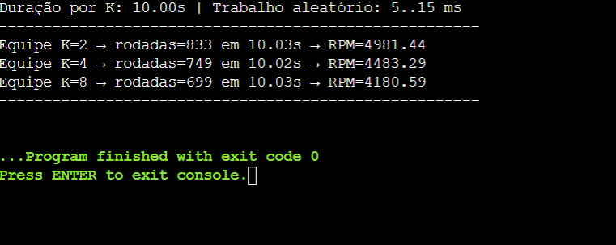

# Questão 1

## Descrição

- Cada cavalo é uma **thread** que avança em passos aleatórios.
- O usuário faz uma **aposta** antes da largada.
- A largada ocorre de forma **sincronizada** para todos os cavalos.
- O **placar** é atualizado com exclusão mútua (sem condições de corrida).
- O **vencedor** é definido de forma determinística, mesmo em caso de empate.
- Ao final, o programa informa se a **aposta** do usuário foi correta.

---

## Decisões

- Mutexes

- score_mutex → protege atualização do placar.
- winner_mutex → garante decisão atômica do vencedor.
- print_mutex → evita embaralhar mensagens no terminal.

- Barreiras (mutex + condvar)

- start_barrier → garante largada sincronizada.
- round_barrier → sincroniza cada rodada entre cavalos.

- Flag

- Protegida por mutex, usada para encerrar todas as threads de forma limpa.

## Como compilar e executar

Compilação:

```bash
gcc -O2 -pthread -o ex1 ex1.c
```


# Questão 2

## Descrição

**buffer circular** de tamanho `N` acessado por **múltiplos produtores** e **múltiplos consumidores**.

- **Semáforos** garantem contagem de **vagas** e **itens** (espera ativa zero).
- **Mutex** protege a **região crítica** do buffer (push/pop).
- Itens têm **timestamp** de enfileiramento para medir **latência de buffer**.
- Medimos **throughput (itens/s)**, **tempo médio de espera de produtores/consumidores** e **latência média no buffer**.
- Consumidores finalizam via **“pílulas venenosas”** (itens sentinela com `id = -1`).

---

## Decisões

- Semáforos

- sem_empty: conta vagas no buffer (produtor faz sem_wait antes de inserir).
  sem_full: conta itens no buffer (consumidor faz sem_wait antes de retirar).

- Mutexes

- buf_mtx → protege push/pop no buffer circular (região crítica).
  metrics_mtx → acumulação de métricas (ns) sem condição de corrida.

- Espera ativa zero

- Todos os bloqueios de disponibilidade (vagas/itens) usam sem_wait (sem busy-wait).
  Acesso ao buffer sempre com mutex.

- Encerramento limpo

- Após todos os produtores terminarem, a main injeta C pílulas buffer para acordar e finalizar cada consumidor.

## Como compilar

```bash
gcc -O2 -pthread -o ex2 ex2.c
```


# Questão 3

## Descrição

**M contas** e **T threads** realizando **transferências aleatórias** entre contas.  
Há dois modos de execução:

- **Correto (SAFE)**: usa travas (mutex) e **prova por asserção** que a **soma global** permanece constante.
- **Incorreto (UNSAFE)**: **sem travas**, para **evidenciar condições de corrida** (a soma final pode diferir do esperado).

Também suportamos **duas políticas de trava**:

- **Mutex por conta** (padrão)
- **Travas por partição** (`P` mutexes; cada conta usa `lock[i % P]`) para reduzir contenção.

---

## Como compilar

```
   bash gcc -O2 -Wall -Wextra -pthread -o ex3 ex3.c
```


# Questão 4

## Descrição

**linha de processamento** com **3 threads fixas**:

1. **captura** → 2) **processamento** → 3) **gravação**.
   Os estágios são conectados por **duas filas limitadas** (circulares) com **mutex + variáveis de condição** (sem busy-wait).
   Processamos **N itens** (IDs `0..N-1`) e finalizamos com **poison pill** (`id = -1`), garantindo **encerramento limpo**, **sem deadlock** e **sem perda/duplicação de itens** (checado com `assert` e vetores de presença).

## Decisões

- Mutexes & Condvars (sem busy-wait)

- mtx → exclusão mútua em put/get;
- not_full → produtores esperam quando cheia;
- not_empty → consumidores esperam quando vazia.

- Protocolo de encerramento (poison pill)

- A captura, ao terminar N itens, enfileira POISON na fila 1.
- O processamento, ao ler POISON, propaga POISON para a fila 2 e encerra.

- A gravação, ao ler POISON, encerra.
  Isso garante término limpo sem deixar threads bloqueadas.

## Como compilar

```bash
gcc -O2 -pthread -o ex4 ex4.c
```


# Questão 5

## Descrição

**pool fixo de N threads** que consome uma **fila concorrente limitada** de tarefas **CPU-bound** (primalidade e Fibonacci iterativo).  
As tarefas são **enfileiradas a partir do `stdin`** (uma por linha) até **EOF**.  
O encerramento é limpo via **poison pills** (1 por worker).  
Provamos que a fila é **thread-safe** e que **nenhuma tarefa se perde** usando contadores atômicos e vetores de presença (`deq_seen`/`done_seen`).

## Decisões

- Fila concorrente (circular limitada)

- Mutex (mtx) para exclusão mútua em put/get.
- Condvars (not_full/not_empty) para bloquear sem busy-wait quando a fila está cheia/vazia.

- Pool fixo + encerramento

- Workers: W threads retiram tarefas de BQ.
- EOF: após ler toda a entrada, a main enfileira W poison pills para finalizar todos os workers sem deadlock.

## Como compilar

```bash
gcc -O2 -pthread -o ex5 ex5.c
```


# Questão 6

## Descrição

# Relatório — Soma total e histograma em paralelo (Map/Reduce com P threads)

## Objetivo

Ler um arquivo grande de inteiros e calcular:

1. **Soma total**;
2. **Histograma de frequências** numa faixa \[MIN, MAX).  
   A leitura é particionada em **P blocos**, cada thread faz **map local** (soma parcial + histograma local) e a **main** faz o **reduce** (merge) com **exclusão mútua mínima**. Medimos **tempo** para estimar **speedup** com P = 1, 2, 4, 8.

---

## Como compilar

```bash
gcc -O2 -Wall -Wextra -pthread -o ex6 ex6.c
```


# Questão 7

## Descrição

**Filósofos Jantando** com garfos modelados por **`pthread_mutex_t`**, duas estratégias que evitam _deadlock_ e coleta de **métricas por filósofo**:

- **(a) Ordem global de aquisição**: cada filósofo pega primeiro o garfo de **menor índice** e depois o de **maior índice** → elimina ciclos.
- **(b) Garçom (semáforo)**: semáforo limita a **N−1 filósofos simultâneos** tentando comer → impossibilita espera circular.

## Parâmetros

- strategy {order|waiter} → escolhe a estratégia anti-deadlock.
- philosophers N → número de filósofos/garfos.
- seconds S → duração da simulação.
- think-ms a b e --eat-ms a b → intervalos de pensar/comer (ms).
- consec-limit K → limite de refeições consecutivas antes de ceder se vizinho estiver com fome (mitiga starvation).

## Decisões

- Garfos = pthread_mutex_t (1 por garfo)
- Exclusão mútua ao “pegar/soltar” cada garfo.

- (a) Ordem global (evita deadlock)

- Cada filósofo calcula first=min(L,R), second=max(L,R) e sempre bloqueia nessa ordem.
- Com ordem total, não há ciclo de espera → sem deadlock.

- (b) Garçom (semáforo N−1)

- sem_wait(waiter) limita a N−1 filósofos concorrendo por garfos.
- Com no máximo N−1 dentro, sempre existe pelo menos um garfo livre na mesa, quebrando ciclos.

- Estado e fairness

- state_mx protege hungry[] (quem está com fome).

- Mitigação de starvation: se um filósofo alcança K refeições consecutivas e algum vizinho está faminto, ele cede -- (zera sequência e faz backoff curto).

## Como compilar

```bash
gcc -O2 -pthread -o ex7 ex7.c
```


# Questão 8 — Estendido (Bursts, Backpressure e Estabilidade)

## Descrição

Extensão do **buffer circular P/C** para simular **rajadas de produção (bursts)** seguidas de **ociosidade**, com **backpressure** por **marca d’água**: produtores **aguardam** quando a ocupação do buffer ultrapassa o **HWM** (High Watermark) e só retomam quando cai abaixo do **LWM** (Low Watermark). A ocupação do buffer é **amostrada periodicamente** para análise de **estabilidade**.

- **Sincronização:** `pthread_mutex` + `sem_t` (`empty`/`full`) sem busy-wait.
- **Backpressure com histerese:** `pthread_cond_t` + `HWM/LWM`.
- **Métricas:** throughput (prod/cons), **tempo médio de espera** (produtor ao enfileirar, consumidor ao retirar) e **latência no buffer**.
- **Série temporal:** `t_ms,occ` (CSV leve) para plotar e avaliar oscilações/saturação.

## Parâmetros

- `-p P` produtores (default `3`)
- `-c C` consumidores (default `2`)
- `-n N` tamanho do buffer (default `64`)
- `-d S` duração (s) (default `12`)
- `-b B` tamanho da **rajada** (default `40` itens)
- `-i MS` **ociosidade** após cada rajada (ms, default `250`)
- `-w H:L` **HWM:LWM** em itens (default `48:32`)
- `-s MS` período de **amostragem** da ocupação (ms, default `100`)

## Como compilar e executar

```bash
gcc -O2 -pthread -o ex8 ex8.c
./ex2_ext
# exemplos:
./ex2_ext -p 3 -c 2 -n 32  -d 12 -b 40 -i 250 -w 24:16  -s 50
./ex2_ext -p 3 -c 2 -n 256 -d 12 -b 40 -i 250 -w 192:128 -s 50
```


# Questão 9

## Descrição

**Corrida de revezamento** com **equipes de K threads**, onde **todas** precisam alcançar uma **barreira** para liberar a próxima “perna” da prova.  
Cada liberação da barreira conta **1 rodada**. O programa mede **rodadas por minuto (RPM)** para diferentes **tamanhos de equipe** em uma mesma execução.

- **Barreira:** `pthread_barrier_t` (padrão) ou implementação própria com **mutex + condvar** (compatibilidade).
- **Latência por perna:** atraso aleatório por thread (simula trabalho) antes da barreira.
- **Medição:** tempo com `CLOCK_MONOTONIC`; contagem de rodadas pela _thread serial_ da barreira (1 incremento por liberação).
- **Encerramento limpo:** _flag_ global desarma o laço; todas as threads fazem um **último `barrier_wait`** para evitar deadlock.

---

## Parâmetros

- `-t S` → duração do experimento **por K** (segundos).
- `-k K1[,K2,...]` → lista de tamanhos de equipe a testar.
- `-w MIN:MAX` → latência aleatória por perna, em **ms** (padrão `0:0`).
- (Opcional) **`-DUSE_CUSTOM_BARRIER`** na compilação para usar barreira manual (mutex/condvar) em sistemas sem `pthread_barrier_t`.

---

## Decisões

- **Sincronização**
  - Barreira: `pthread_barrier_t` (ou _custom_ com `pthread_mutex_t` + `pthread_cond_t`).
  - Contagem de rodadas: **apenas** a _thread serial_ incrementa → evita disputa/overcount.
- **Medição e robustez**
  - Relógio `CLOCK_MONOTONIC` (imune a saltos de sistema).
  - **Shutdown sem deadlock:** após desarmar `running`, todas passam uma **última** vez na barreira.
- **Exploração de desempenho**
  - Varia-se **K** e a **latência** `-w MIN:MAX` para observar a queda de RPM por contenção/sincronização.

---

## Como compilar e executar

Compilação (Linux e ambientes com `pthread_barrier_t`):

```bash
gcc -O2 -pthread -o ex9 ex9.c

```



# Questão 10

## Descrição

Cenário com **múltiplos recursos** (mutexes) e **múltiplas threads** que, **propositalmente**, podem entrar em **deadlock** por adquirirem **locks em ordens distintas**.  
Uma thread **watchdog** monitora o sistema e, se não houver **progresso por _T_ segundos**, emite um **relatório** dos recursos/threads suspeitos (o que cada thread **segura** e **o que está tentando adquirir**).  
Em seguida, executamos uma **versão corrigida** que impõe **ordem total de travamento** (sempre `lock(a)`, depois `lock(b)` com `a < b`), e comparamos os comportamentos.

---

## Decisões

- **Recursos**: `R` mutexes (`pthread_mutex_t`) indexados `0..R-1`.
- **Workers**: `W` threads; cada uma tenta adquirir **dois recursos** por iteração.
  - **Fase A (insegura)**: ordem de aquisição **varia** entre as threads → pode haver **espera circular** ⇒ **deadlock**.
  - **Fase B (segura)**: ordem **total** (sempre menor índice → maior índice) ⇒ **sem deadlock**.
- **Watchdog**:
  - Observa `ops` globais e `last_progress` por thread.
  - Se `ops` não muda por **T segundos**, imprime **snapshot**:
    - `hold=(a,b)`: locks que a thread segura;
    - `wait=x`: lock que a thread está tentando adquirir;
    - `last_prog`: tempo desde o último progresso;
    - `ops`: iterações concluídas pela thread.
  - Encerra a fase insegura ao detectar **ausência de progresso**.

---

## Parâmetros

- `-r R` → número de **recursos** (padrão: 5)
- `-w W` → número de **workers** (padrão: 5)
- `-t T` → **timeout** da watchdog em segundos (padrão: 3s)
- `-d S` → **duração** por fase em segundos (padrão: 12s)

Sem argumentos, o programa roda **Fase A** (insegura) seguida da **Fase B** (segura) com os **padrões**, ideal para compiladores online.

---

## Como compilar e executar

```bash
gcc -O2 -pthread -o ex10 ex10.c
./ex10
# ou com parâmetros:
./ex10 -r 5 -w 6 -t 3 -d 12
```


